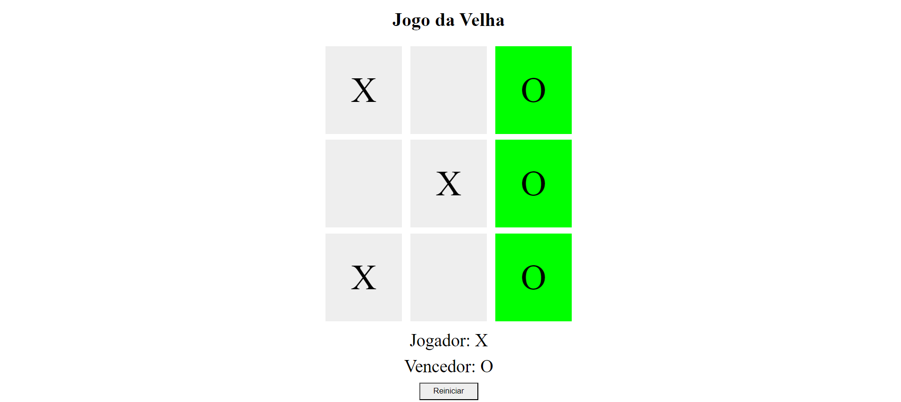

# Jogo da Velha

Este é um simples jogo da velha desenvolvido em HTML, CSS e JavaScript. O jogo é jogado em um tabuleiro 3x3 onde dois jogadores alternam entre "X" e "O" para marcar as células. O objetivo é conseguir três símbolos iguais em linha, coluna ou diagonal.

## Print do Jogo

## Instruções de Uso

1. Faça o download ou clone este repositório em sua máquina local.
2. Abra o arquivo `index.html` em seu navegador da web.
3. Clique em qualquer célula vazia para marcar com "X" ou "O", alternando entre os jogadores.
4. O jogo continuará até que um jogador vença ou não haja mais células disponíveis.
5. Você pode reiniciar o jogo a qualquer momento clicando no botão "Reiniciar".

## Estrutura do Projeto

- **index.html**: Contém a estrutura do jogo da velha e liga o arquivo JavaScript `velha.js`.
- **estilo.css**: Arquivo CSS para estilizar o jogo da velha.
- **velha.js**: Arquivo JavaScript que contém a lógica do jogo.

## Créditos

Este jogo foi desenvolvido por Matheus como parte de um projeto de aprendizado em desenvolvimento web.
